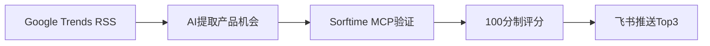

## 概念

趋势选品雷达 = 每天自动扫描 Google Trends 热门新闻 → AI提取产品机会 → Sorftime MCP 验证市场 → 飞书推送 Top 3

不是"自动预测爆款"，是"趋势发现雷达"。

## 数据流



## Sorftime MCP 调用链（替代原文的卖家精灵）

| 阶段 | 目的 | Sorftime工具 |
|------|------|-------------|
| 需求验证 | 看搜索量级 | keyword_detail (月搜索量/竞争度) |
| 趋势判断 | 看搜索量涨跌 | keyword_trend |
| 长尾机会 | 找细分入口 | keyword_extends |
| 市场格局 | 看价格带/竞争 | category_report |
| 产品初筛 | 看竞品价格/评论 | search_categories_broadly + potential_product |

## 评分框架（100分制）

| 维度 | 满分 | 数据源 |
|------|------|--------|
| 新闻信号强度 | 20 | 新闻趋势RSS（热度+持续度） |
| 搜索需求 | 25 | keyword_detail（月搜索量>1000） |
| 增长趋势 | 15 | keyword_trend（搜索量上升） |
| 竞争烈度 | 20 | category_report（HHI/新品占比） |
| 价格利润 | 20 | product_search（均价+毛利率估算） |

≥65分跟进，<65分标记观察

## 推送格式

```
🔥 今日趋势选品 Top 1：[产品方向]

📰 新闻信号：[原文摘要]
🎯 产品假设：[场景+人群+需求]
🔑 核心关键词：[关键词]（月搜索量 N）
📊 市场速览：[价格带] / [竞争格局]
⭐ 机会评分：[分数]
👉 下一步：[今天该做什么]
```

## 运行方式

cron job，每天早上8点执行
